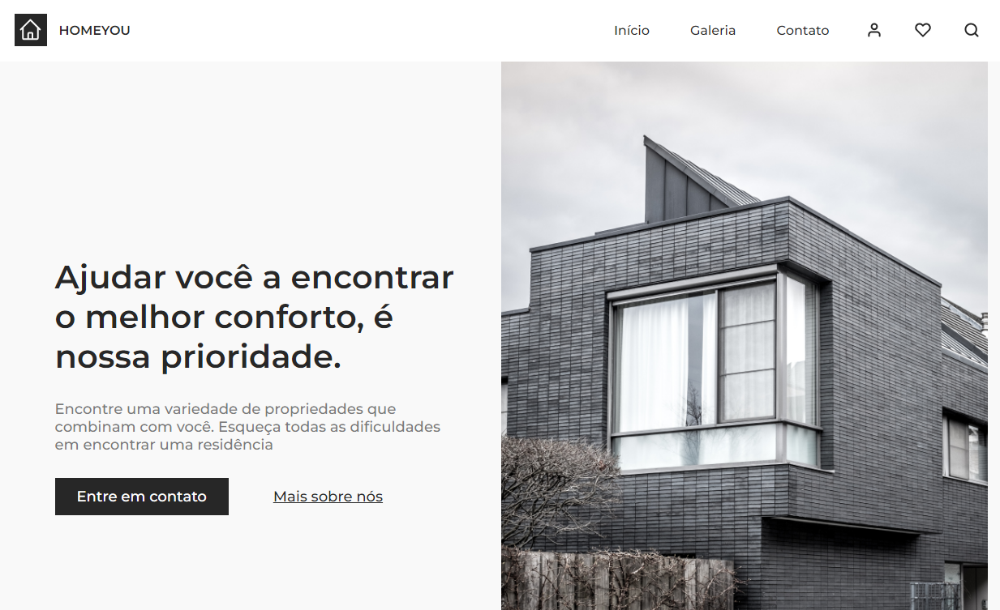

# HOMEYOU

## desafio25-codelandia

####Este é o desafio _25_ da comunidade _Codelândia_ por [iuricode](https://github.com/iuricode)!

## 🎯 Objetivo

O desafio consiste em desenvolver uma landing page de uma empresa de arquitetura fictícia de acordo com o layout disponibilizado no [Figma](https://www.figma.com/file/Yb9IBH56g7T1hdIyZ3BMNO/Desafios---Codelândia?node-id=88764%3A796).

## 📚 Seções

O site é composto por 6 seções diferentes:

- **Navegaçao:** Menu responsivo com links internos;
- **Intro:** Contém uma breve apresentação da página e um botão de entre em contato;
- **Design:** Contém uma breve apresentação sobre design dos imóveis;
- **Galeria:** Contém uma galeria de imagens.
- **FAQ:** Seção sobre dúvidas através de um Accordion-List.
- **Orçamento:** Contém botão para entrar em contato.
- **Footer:** Mais links.

## 🛠️ Tecnologias utilizadas

Para o desenvolvimento deste site utilizei as seguintes tecnologias:

- HTML;
- CSS;
- JavaScript;

### ⚙️ Ajustes e melhorias

O projeto ainda está em desenvolvimento e as próximas atualizações serão voltadas nas seguintes tarefas:

- ✔️ Criar Acorddion List
- ✔️ Criar Scroll Suave
- ✔️ Criar Menu Mobile
- ❌ Criar Modal de Login e Favoritos
- ❌ Criar Slide na Galeria
